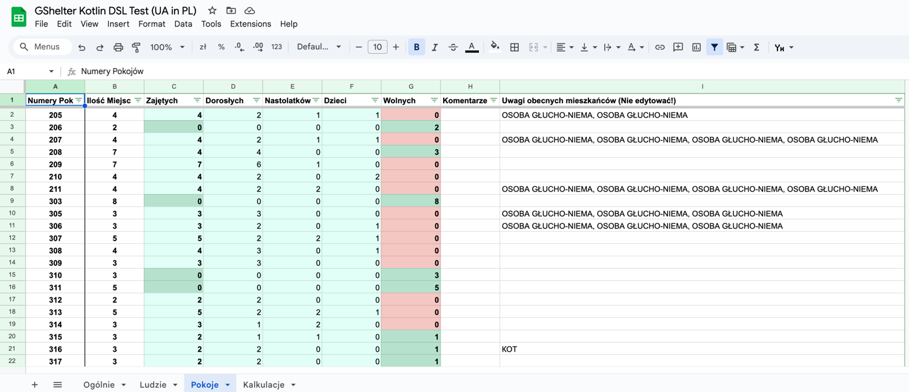

# GShelter

Kotlin app and DSL to deploy a simplistic people-in-shelter management system to Google Sheets.

## Concept
Complex hotel and hostel systems does not support fully needs of temporary public shelter systems,
that don't rely on booking dates, cleaning services, canteen menu, etc.

Moreover, public budgets can be pretty tight.

I've heard next requirements:
- Simple checkin
- Simple checkout
- Statistics for occupancy, age, sex
- Table for people
- Table for rooms
- Filtering, grouping
- Counting people groups based on some characteristic
- Simple enough to be used by shelter workers, that may have zero HoReCa experience
- Simple enough to be used by shelter workers, that may have close to no computer experience
- Internationalization (Polish and Ukrainian), as users don't know English
- Extensibility and supportability
- Authorization and authentication
- Cloud

Based on my experience, this can be implemented with Google Sheets.   
But there are problems with such a solution:
- It is hard or impossible to migrate entire spreadsheet with all the functionality to another spreadsheet for another Google user
- Recreating same spreadsheet functionality manually takes too much time
- It is not in English

GShelter was created as an option to deploy Google Sheets definitions via Google Sheets API to a precreated empty Spreadsheet.

## Example
- [GShelter Kotlin DSL Test (UA in PL)](https://docs.google.com/spreadsheets/d/1euvDCejeiPUm26KV3UKSSf2rOi2-EprraeFtZVBQ6sQ)
- [GShelter Kotlin DSL Test (UA in UA)](https://docs.google.com/spreadsheets/d/1u7_RB4aPq0VpiaSH-xWns9u5tdLc-1J3JeDzEwXVyeQ)  

Definition is in `App.kt`.
Same code was successfully used in production, deployed to 7 shelters.

## Features
Running code generates Google Spreadsheet with a number of sheets with functions, data validation, named ranges, references and cross-references, etc.

### Overview sheet
Sheet with current and total statistics.
Shows current statistics of rooms and placements, people (by age and sex).  
Also, shows total statistics by sex, age, and age category.


### People sheet

Main sheet for people information and checkin-checkout flow.    

Common suggestion is to apply `filter` to `Checkout date` column in order to see only people, that are currently in a shelter.  
**Important**. Fields with suffix `(Automatic)` **should not be filled**.  
**Important**. Rows should not be removed, it breaks calculations.  
If you want to remove data — just remove the data, do not delete the row.  
**Important**. If person checked out — set date and hide with a filter, **do not remove person data**.    
**Important**. Paste data with `Ctrl+Shift+V`, **NOT** `Ctrl+V`, that's a Google Sheets limitation.


### Rooms sheet

Provides control and statistics of Rooms in a shelter.

Only rows `Room number`, `Number of spaces` and `Comments` should be changed.  
All other rows, including `People notes` are calculated automatically.  
In order to add a room — just add a row and provide room number and available spaces.  
Don't forget to change room number of every person in `People` sheet, if any room number was changed.



### Calculations sheet

Simple data analytics tool.  
Allows to filter data without blocking `People` sheet.

In current example, one may observe all people, who checked out from room 206 since 24.02.2022.


### Technical sheets

There is a number of hidden utility sheets.  
`Technical!PeopleCurrent` helps to simplify lots of calculation to filter only current people.  
`Technical!Do not change` contains enums as named ranges, like regions, sexes, age categories, etc.


### Google Sheets
Enormous amount of requirements are handled by Google Sheets by itself, as it allows
- Localization and internationalization based on Spreadsheet settings
- Authorization is automatically handled by Google Identity
- Sheet can be private and shared on-demand with other Google users
- Google Sheets is in Cloud
- Being a very popular option, any user may find information about everything in a search bar
- Free

### Localization and Legalization
Project provides two concepts — Localization and Legalization.  
Localization represents simple support of some language in a Spreadsheet.  
Legalization represents support of a certain refugee group in a specific country of asylum represented in certain language.
Legalization relies on Localization.  

For example, Legalization provides Region names.  
For Polish refugees in Poland those would be województwa in Polish.  
For Ukrainian refugees in Ukraine those would be oblasts in Ukrainian.
For Ukrainian refugees in Poland those would be oblasts in Polish or in Ukrainian, based on chosen l10n.

As for identification number, for Polish in Poland it would be PESEL and for Ukrainians in Ukraine that would be ID card number.    
On the other hand, for Ukrainian in Poland that would be a PESEL.

## Running the code

### Clone 
```zsh
git clone https://github.com/sikrinick/gshelter.git 
```

### Add Google Api integration
Please, check [Google's Quickstart for Java](https://developers.google.com/sheets/api/quickstart/java) to generate `credentials.json`.

Then, put it to `src/resources/credentials.json`.  
[Geshikt](https://github.com/sikrinick/geshikt) library, this solution is based on, will trigger auth process, 
that will store `write` token automatically to `src/resources/tokens/StoredCredential`.

### Run
```zsh
./gradlew run
```

## Code Structure

Entry-point is in `App.kt`.   
Firstly, it defines Localization, Legalization and Google Sheets context rules.   
```kotlin
val id = id("put your google sheets id")

val legalization = UkrainianInPoland(
    localization = Polish
)
val l10n = legalization.localization

gShelter(
    context = DefaultContext.copy(
        maxRowCount = 2999
    )
) {
    create(
        id = id,
        l10n = l10n,
        legalization = legalization,
   ...   
}
```
Then, it establishes a list of columns, that will be used in `People` and `Calculation` sheets.
```kotlin
create(
    ...
    legalization = legalization,
        columns = listOf(
        RoomColumn(l10n),
        FirstNameColumn(l10n),
        LastNameColumn(l10n),
        DocumentTypeColumn(l10n),
        DocumentIdColumn(l10n),
        AsylumDocumentIdColumn(legalization),
        RegionColumn(legalization),
        CityColumn(l10n),
        BirthdateColumn(l10n),
        SexColumn(l10n),
        BorderCrossDateColumn(l10n),
        CheckInDateColumn(l10n),
        PhoneNumberColumn(l10n),
        RemarksColumn(l10n),
        CheckOutDateColumn(l10n),
        AgeColumn(l10n),
        AgeCategoryColumn(l10n),
    )
    ...
```

As well as a list of rooms in a shelter with a number of maximum available spaces in a room.

```kotlin
create(
    ...
    rooms = listOf(
        Room("205", 4),
        Room("206", 2),
        Room("207", 4),
        Room("208", 7),
        Room("209", 7),
        Room("210", 4),
        Room("211", 4),
        Room("303", 8),
        Room("305", 3),
        Room("306", 3),
        Room("307", 5),
        Room("308", 4),
        ...
    )
)
```

## Known issues

### People sheet

There may be an issue in `People` sheet with `Room` column. Try to disable and enable validation for that column.

### Calculations sheet

There may be an issue with `Room` cell. Please, go to **hidden** `Technical!Do not change` sheet and:
1. Copy cell that has `#NAME?`
2. Delete value
3. Paste with `Ctrl+V` (**NOT** `Ctrl+Shift+V`)

